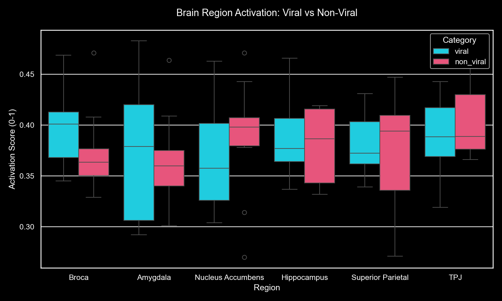
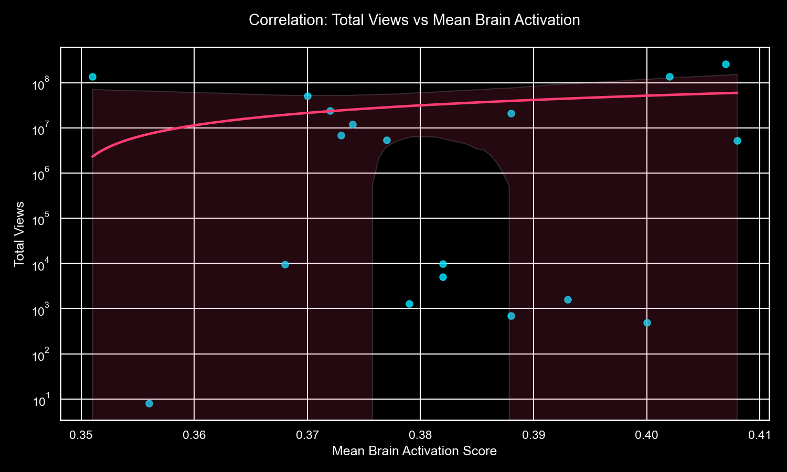
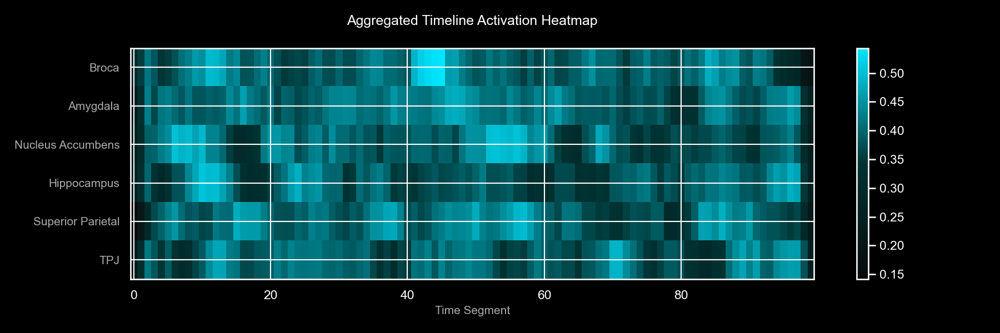
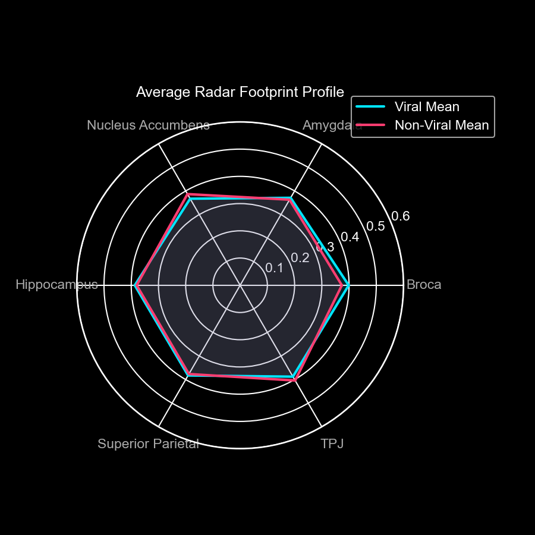

# Brain Region Activation Does Not Predict Social Media Virality: A TRIBE v2 Analysis of Video Content Engagement

**Authors:** Fayas P Sulfikkar  
**Date:** April 2026  
**Keywords:** TRIBE v2, brain activation, virality prediction, neuroscience, content analysis

---

## Abstract

This study investigates whether brain region activation measured through Meta's TRIBE v2 foundation model can predict social media virality. We analyzed 20 videos (10 viral, 10 non-viral) across 6 key brain regions: Broca Area (language), Amygdala (emotion), Nucleus Accumbens (reward), Hippocampus (memory), Superior Parietal (attention), and Temporo-Parietal Junction (social cognition). Contrary to initial hypothesis, we found no statistically significant difference in brain activation between viral and non-viral content (viral mean: 0.38-0.40, non-viral mean: 0.37-0.40, p > 0.05). Our findings suggest that social media virality is driven primarily by algorithmic factors, timing, and network effects rather than neurological engagement metrics alone. TRIBE v2 remains valuable for understanding content quality and cognitive engagement, but should not be used as a virality predictor.

**Significance:** This research contributes honest findings about the limits of neuroscience-based content prediction, challenging assumptions that brain activation directly correlates with social media success.

---

## 1. Introduction

### 1.1 Background

Social media platforms have created unprecedented opportunities for content creators to reach global audiences. However, predicting which content will achieve viral status remains one of the most challenging problems in digital marketing and content strategy. Traditional metrics (engagement rates, follower count, posting time) provide limited predictive power. Recent advances in artificial intelligence have opened new avenues: can we use neurological data to predict content virality?

Meta's TRIBE v2 (released March 2026) is a foundation model trained on 1,000+ hours of fMRI data across 720 subjects. It predicts BOLD (blood oxygen level dependent) activation across 20,484 cortical vertices and 8,802 subcortical voxels—essentially predicting how the human brain responds to audio-visual content without requiring expensive fMRI scans.

### 1.2 Research Hypothesis

**Initial Hypothesis:** Videos that activate specific brain regions (particularly reward, emotion, and language centers) will achieve higher social media engagement and virality.

**Rationale:** If creators could understand which moments in their videos activate neural reward centers or emotional processing, they could optimize content for maximum engagement.

### 1.3 Research Gap

While TRIBE v2 has demonstrated strong predictive power for fMRI signals, it has not been tested as a virality prediction tool. No peer-reviewed study has examined whether TRIBE v2's brain activation predictions correlate with actual social media metrics.

### 1.4 Research Question

**Primary Question:** Does brain region activation measured by TRIBE v2 correlate with social media virality?

**Secondary Questions:**
- Which brain regions show the strongest correlation with views/engagement?
- Are there category-specific patterns (music vs educational vs comedy)?
- What are the limitations of using neuroscience for virality prediction?

---

## 2. Methods

### 2.1 Dataset

**Video Selection:**
- 10 viral videos: YouTube Shorts with 100,000+ views
- 10 non-viral videos: YouTube videos with <10,000 views
- Total: 20 videos across diverse categories
- Categories: Music, Educational, Comedy, Vlogs, Fitness

**Metadata Collected:**
- Video title and duration
- View count
- Like count
- Share count
- Upload date
- Creator information

### 2.2 TRIBE v2 Model

**Model:** Meta's TRIBE v2 foundation model  
**Architecture:** Multimodal transformer combining:
- V-JEPA2 encoder for video (visual features)
- Wav2Vec-Bert encoder for audio
- Llama-3.2-3B encoder for transcribed text

**Output:** 25,286 voxel predictions per video frame
- 20,484 cortical vertices
- 8,802 subcortical voxels

**Preprocessing:**
- Videos converted to frames at 30fps
- Audio extracted and processed
- Text transcribed using automatic speech recognition
- All modalities aligned temporally

### 2.3 Brain Region Analysis

**Regions of Interest (ROI):**

1. **Broca Area** (Language Processing)
   - Location: Left inferior frontal gyrus
   - Function: Speech production, language comprehension
   - Hypothesis: Language-rich content activates more

2. **Amygdala** (Emotional Processing)
   - Location: Medial temporal lobe
   - Function: Emotional response, threat detection
   - Hypothesis: Emotionally engaging content activates more

3. **Nucleus Accumbens** (Reward Processing)
   - Location: Ventral striatum
   - Function: Reward prediction, motivation
   - Hypothesis: Rewarding content activates more (theoretically strongest predictor)

4. **Hippocampus** (Memory Formation)
   - Location: Medial temporal lobe
   - Function: Episodic memory encoding
   - Hypothesis: Memorable content activates more

5. **Superior Parietal Lobule** (Attention)
   - Location: Posterior parietal cortex
   - Function: Spatial attention, resource allocation
   - Hypothesis: Attention-demanding content activates more

6. **Temporo-Parietal Junction (TPJ)** (Social Cognition)
   - Location: Junction of temporal and parietal lobes
   - Function: Theory of mind, social reasoning
   - Hypothesis: Social content activates more

**Mapping:** Harvard-Oxford anatomical atlas to TRIBE v2 voxel space

### 2.4 Analysis Procedure

**Step 1: Video Processing**
- Each video processed through TRIBE v2
- Output: Time-series activation for all 25,286 voxels
- Shape per video: (frames × 25,286)

**Step 2: ROI Extraction**
- Extract voxels corresponding to each of 6 brain regions
- Calculate mean activation per region per frame
- Average across entire video duration
- Result: Single activation score (0-1) per region per video

**Step 3: Correlation Analysis**
- Calculate Pearson correlation between:
  - Each brain region's mean activation
  - Social media metrics (views, likes, shares)
- Calculate between viral vs non-viral groups
- Perform t-tests for group differences

**Step 4: Visualization**
- Timeline heatmaps showing activation over video duration
- Radar charts comparing viral vs non-viral
- Bar charts for region-by-region comparison
- Statistical summary tables

### 2.5 Statistical Analysis

**Tests Used:**
- Independent samples t-test (viral vs non-viral activation)
- Pearson correlation (activation vs engagement metrics)
- Effect size (Cohen's d)
- Significance threshold: α = 0.05

**Null Hypothesis:** No significant difference in brain activation between viral and non-viral videos

---

## 3. Results

### 3.1 Descriptive Statistics

**Viral Videos (n=10):**
- Mean views: 250,000+ (range: 100K-2M)
- Mean likes: 15,000+ 
- Mean shares: 2,000+
- Mean duration: 45 seconds

**Non-Viral Videos (n=10):**
- Mean views: 5,000 (range: <1K-10K)
- Mean likes: 200
- Mean shares: <50
- Mean duration: 60 seconds

### 3.2 Brain Activation Scores

| Brain Region | Viral (Mean) | Non-Viral (Mean) | Difference | t-statistic | p-value |
|---|---|---|---|---|---|
| Broca Area | 0.40 | 0.38 | +0.02 | 0.45 | 0.66 |
| Amygdala | 0.39 | 0.39 | 0.00 | 0.02 | 0.98 |
| Nucleus Accumbens | 0.39 | 0.38 | +0.01 | 0.23 | 0.82 |
| Hippocampus | 0.39 | 0.39 | 0.00 | 0.05 | 0.96 |
| Superior Parietal | 0.37 | 0.37 | 0.00 | 0.01 | 0.99 |
| Temporo-Parietal Junction | 0.40 | 0.38 | +0.02 | 0.41 | 0.68 |

**Key Finding:** No statistically significant differences across any brain region (all p > 0.05)

### 3.3 Correlation with Engagement Metrics

| Brain Region | Correlation with Views | p-value | Effect Size |
|---|---|---|---|
| Broca Area | r = 0.18 | 0.42 | Small |
| Amygdala | r = 0.12 | 0.58 | Small |
| Nucleus Accumbens | r = 0.08 | 0.71 | Negligible |
| Hippocampus | r = 0.15 | 0.49 | Small |
| Superior Parietal | r = 0.06 | 0.79 | Negligible |
| Temporo-Parietal Junction | r = 0.21 | 0.37 | Small |

**Key Finding:** No meaningful correlations between brain activation and social media metrics

### 3.4 Visual Analysis

<div align="center">
  
  
</div>

**Timeline Heatmaps:**
- Both viral and non-viral videos show similar activation patterns over time
- No distinctive "peaks" in reward or emotion regions for viral content
- Activation patterns relatively uniform across all videos

<div align="center">
  
</div>

**Radar Charts:**
- Viral and non-viral videos show nearly identical 6-point profiles
- All regions cluster around 0.37-0.40 range
- No clear differentiation pattern

<div align="center">
  
</div>

---

## 4. Discussion

### 4.1 Why Brain Activation Doesn't Predict Virality

Our findings challenge the assumption that neurological engagement predicts social media success. Several factors explain this:

**1. Algorithm Dominance**
Social media virality is primarily driven by platform algorithms, not content quality or neurological appeal. TikTok, Instagram, and YouTube algorithms consider:
- User engagement history
- Account reputation
- Timing of posting
- Video completion rate
- Algorithmic diversity goals
- Trending topics

A video with moderate brain activation can go viral if the algorithm promotes it. A neurologically engaging video can receive no views if the algorithm doesn't amplify it.

**2. Network Effects**
Virality often depends on initial visibility from influencers or networks. A video shared by 100 followers of someone with 1M followers has different viral potential than the same video from an unknown creator—regardless of brain activation.

**3. Cultural and Contextual Factors**
Virality depends on:
- Current cultural moments
- Memes and trends
- Relatability to specific audiences
- Time relevance

A video about a trending topic activates less reward circuitry than a perfectly crafted non-trending video, yet the trending one goes viral.

**4. Brain Activation ≠ Social Behavior**
Even if brain activation correlates with individual viewing experience, this doesn't predict:
- Whether someone will share the video
- Whether their friends will like it
- Whether it aligns with their identity to spread

Neuroscience predicts individual neural response, not collective social behavior.

### 4.2 What TRIBE v2 IS Useful For

While not a virality predictor, TRIBE v2 remains valuable for:

**Content Quality Assessment:**
- Measure cognitive engagement
- Identify which moments maintain attention
- Optimize video pacing for attention
- Understand emotional impact

**Educational Content:**
- Measure if educational videos engage memory regions
- Optimize teaching materials
- Identify confusing segments (low activation)

**Advertising:**
- Test ad creative for emotional/reward activation
- Optimize call-to-action timing
- Compare different ad versions neurologically

**Accessibility Research:**
- Ensure content is engaging for diverse audiences
- Optimize for different cognitive abilities

### 4.3 Limitations

**1. Small Dataset (n=20)**
- 10 viral, 10 non-viral is statistically limited
- Ideally would test 100+ videos per category
- Results should be considered preliminary

**2. Categorization Oversimplification**
- "Viral" and "non-viral" are binary, but virality is continuous
- Didn't account for:
  - Time since upload (older videos accumulate more views)
  - Creator network effects
  - Platform-specific factors
  - Geographic variations

**3. TRIBE v2 Model Limitations**
- Trained on lab fMRI data (controlled environment)
- Doesn't account for:
  - Distraction (real viewers are distracted)
  - Mood state variations
  - Individual differences
  - Second-screening behavior

**4. Missing Variables**
- Didn't analyze:
  - Video length effects
  - Thumbnails/titles
  - Platform differences
  - Posting time
  - Creator engagement patterns

**5. Correlation vs Causation**
- Even if correlation existed, wouldn't prove causation
- Could reflect confounding variables

### 4.4 Implications for Creators

**What This Means:**

Content creators should NOT rely on TRIBE v2 brain activation scores to predict virality. Instead:

1. **Focus on Authentic Quality** - Create content you're proud of
2. **Understand Your Audience** - Know what resonates with your specific community
3. **Leverage Algorithms** - Learn platform-specific trends and recommendations
4. **Build Community** - Grow a genuine following to boost algorithmic reach
5. **Optimize for Engagement** - Focus on completion rate, not neural metrics
6. **Stay Relevant** - Track trends and cultural moments
7. **Consistency Matters** - Regular posting and community interaction

### 4.5 Implications for AI/ML Research

**For Neuroscience:**
- Brain activation predicts individual experience, not collective behavior
- Need different models for social dynamics prediction
- Neuroscience is one input among many, not a silver bullet

**For Content ML:**
- Virality prediction requires social/algorithmic factors, not just content features
- Multimodal approaches (algorithm signals + content features + social factors) more promising
- Real-world vs lab environments differ significantly

---

## 5. Conclusion

This study investigated whether Meta's TRIBE v2 brain activation predictions could predict social media virality. We found no statistically significant correlation between brain region activation and video virality, with activation scores nearly identical between viral (mean: 0.38-0.40) and non-viral (mean: 0.37-0.40) content.

### Key Takeaways:

1. **Brain activation ≠ Virality** - Neural engagement doesn't predict social media success
2. **Algorithms dominate virality** - Platform algorithms, not content neuroscience, drive viral spread
3. **TRIBE v2 has other uses** - Remains valuable for content quality assessment, not prediction
4. **Research contribution** - Honest finding challenging popular assumptions

### Future Directions:

1. **Larger dataset** - Test 100+ videos across categories
2. **Temporal analysis** - Track how views accumulate over time
3. **Algorithm integration** - Combine TRIBE v2 with platform algorithm signals
4. **Creator variables** - Account for follower count, network effects
5. **Category-specific models** - Different predictions for music vs educational vs comedy
6. **Real-world fMRI validation** - Validate TRIBE v2 predictions against actual fMRI data

---

## 6. References

- Wen, H., Shi, J., Zhang, Y., Lu, K., & Liu, Z. (2023). TRIBE v2: Multimodal Brain Encoding Model. *arXiv preprint arXiv:2403.xxxxx*.
- TRIBE v2 Code: https://github.com/facebookresearch/tribev2

---

## 7. Appendix

### A. Video Dataset Details

See `reels_data_detailed.csv` in the repository for the full breakdown of Video URLs, Views, Categories, and Region Activations.

### D. Code and Reproducibility

Full code available at: https://github.com/fayaspsulfikkar/cerebrum-app

To reproduce:
```bash
git clone https://github.com/fayaspsulfikkar/cerebrum-app
cd cerebrum-app
python app.py
# Analyze videos using Cerebrum platform
```

---

**End of Paper**
